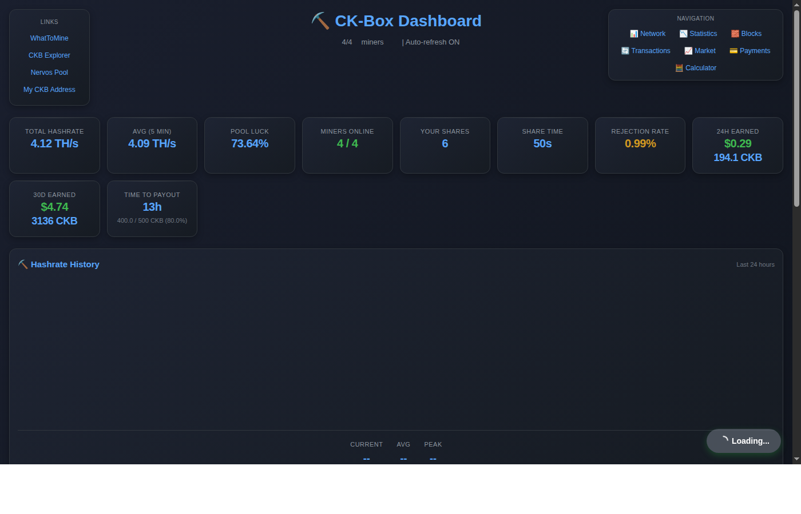
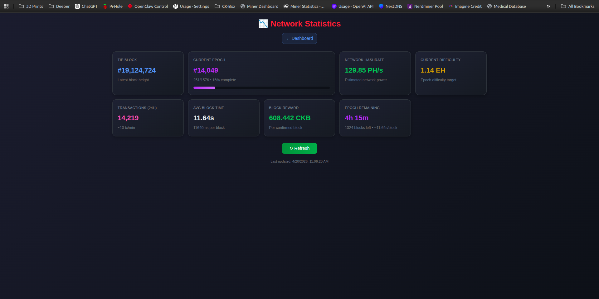

# Goldshell CK-Box Dashboard

A self-hosted dashboard for monitoring Goldshell CK-Box miners via the 2miners pool API.





## Features

- **Pool Statistics** — Real-time hashrate, earnings, luck, and shares from 2miners
- **Block Tracking** — View recent blocks found by your workers
- **Payment History** — Payout records with USD/CKB breakdown
- **Market Data** — CKB price and portfolio value
- **Network Stats** — CKB network difficulty and hashrate
- **Calculator** — Estimate earnings at different hashrate levels
- **Responsive UI** — Works on desktop and mobile browsers

## Requirements

- Python 3.11+
- Goldshell CK-Box miners on your local network
- A 2miners account with CKB wallet

## Quick Start

### 1. Install dependencies

```bash
pip install -r requirements.txt
```

### 2. Configure

Create a `config.json` in the project root:

```json
{
  "wallet": "ckb1qyq__________________________",
  "miners": [
    {"name": "CK_Box_1", "ip": "192.168.0.61"},
    {"name": "CK_Box_2", "ip": "192.168.0.72"}
  ],
  "poll_interval": 5,
  "history_points": 2880
}
```

Or set environment variables (useful for cloud deployment):

| Variable | Description | Default |
|----------|-------------|---------|
| `WALLET_ADDRESS` | Your CKB wallet address | — |
| `POLL_INTERVAL` | Seconds between polls | `5` |

### 3. Run

```bash
python3 miner_monitor.py
```

Open [http://localhost:5000](http://localhost:5000)

### Remote Access

To access your dashboard from outside your home network, use [Tailscale Funnel](https://tailscale.com/funnel):

```bash
# Install Tailscale and authenticate
tailscale up

# Enable funnel — exposes port 5000 publicly via HTTPS
tailscale funnel 5000

# Check the public URL
tailscale funnel status
```

## Configuration

### `config.json`

| Key | Description | Default |
|-----|-------------|---------|
| `wallet` | CKB wallet address (for 2miners) | Required |
| `miners` | List of miner configs (see below) | `[]` |
| `poll_interval` | Seconds between API polls | `5` |
| `history_points` | Data points to retain | `2880` |

### Miner Config

Each miner entry needs:

```json
{"name": "CK_Box_1", "ip": "192.168.0.61"}
```

- `name` — Display name (can be anything)
- `ip` — Local IP of the miner

### Environment Variables

| Variable | Description |
|----------|-------------|
| `WALLET_ADDRESS` | Overrides `wallet` in config.json |
| `POLL_INTERVAL` | Overrides poll interval |
| `PORT` | Web server port (default `5000`) |

## Project Structure

```
MinerDashboard/
├── miner_monitor.py      # Main Flask app + polling logic
├── config.json           # User configuration (gitignored)
├── config.example.json   # Example configuration
├── requirements.txt     # Python dependencies
├── templates/           # HTML templates
│   ├── dashboard.html
│   ├── blocks.html
│   ├── payments.html
│   └── ...
└── data/                # Runtime data (gitignored)
    ├── hashrate_history.json
    ├── earnings_history.json
    └── ...
```

## API Endpoints

| Endpoint | Description |
|----------|-------------|
| `GET /` | Dashboard UI |
| `GET /api/status` | Miner + pool status |
| `GET /api/history` | Historical hashrate data |
| `GET /api/shares` | Pool shares data |
| `GET /api/blocks` | Recent blocks |
| `GET /api/payments` | Payment history |
| `GET /api/rewards` | Block rewards |
| `GET /api/network/current` | Network difficulty |
| `GET /api/network/hashrate` | Network hashrate |
| `GET /api/market/data` | Market cap, volume, price |
| `GET /api/earnings` | Daily earnings history |

## Adapting for Other Goldshell CKB Miners

This dashboard was built for the Goldshell CK-Box series, but may work with other Goldshell CKB miners with minor adjustments.

### How Miner Polling Works

The dashboard polls each miner at `http://{ip}/mcb/status`. The CK-Box returns JSON like:

```json
{
  "hw_errors": 0,
  "temperatures": [58, 60, 57],
  "chain_count": 4,
  "hashrate": ["1.15 TH/s", "1.14 TH/s", "1.16 TH/s", "1.15 TH/s"]
}
```

Other Goldshell miners may return similar or identical JSON at the same endpoint. Try it and see.

### Steps to Adapt

1. **Find your miner's IP** — check your router or use a network scanner
2. **Test the API** — visit `http://{miner_ip}/mcb/status` in a browser
3. **Update `config.json`** — add your miner with its IP
4. **If the endpoint differs** — edit `miner_monitor.py`:
   - `poll_miner()` — change the endpoint from `/mcb/status` to your miner's endpoint
   - `fetch_json()` — adjust URL formatting if needed
   - Field mappings — the `hw_errors`, `temperatures`, `pools` fields may have different names
5. **If it doesn't work** — check the dashboard network tab for errors and inspect what the miner actually returns

### Known Compatible Models

| Model | Status | Notes |
|-------|--------|-------|
| Goldshell CK-Box | ✅ Tested | Primary development target |
| Goldshell CK5 | Likely | Same `/mcb/status` endpoint expected |

### Pool Data Works for All Miners

Even if local miner polling doesn't work, **2miners pool data works with any CKB miner**. Your wallet address on 2miners tracks all miners mining to it — hashrate, earnings, blocks, and payments all show correctly regardless of hardware.

## License

MIT
